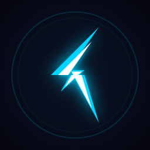

<!-- ============================================ -->
<!--     LIGHTNING GAMES - README v3.0          -->
<!-- ============================================ -->

<p align="center">
  
</p>

<h1 align="center">
  ⚡ Lightning Games
</h1>

<p align="center">
  <b>A premium neon-themed game arcade that lives in your system tray.</b><br/>
  <sub>40 handcrafted games • One global hotkey • Zero friction • 100% offline</sub>
</p>

<br/>

<p align="center">
  
  
  
  
  
</p>

<p align="center">
  
  
  
  
  
  
</p>

<br/>

<p align="center">
  <code>Press</code> <kbd>Ctrl</kbd> + <kbd>Alt</kbd> + <kbd>G</kbd> <code>from anywhere to summon the arcade.</code>
</p>

<p align="center">
  <a href="#-why-lightning-games">Why?</a> •
  <a href="#-quick-start">Quick Start</a> •
  <a href="#-game-library">Games</a> •
  <a href="#-features">Features</a> •
  <a href="#-building-from-source">Build</a> •
  <a href="#-technical-documentation">Docs</a>
</p>

---

## ⚡ Why Lightning Games?

### The Problem

You're working. You need a 2-minute break. You want to play a quick game.

**What happens next?**

- **Steam/Epic**: Click icon → Wait 10 seconds → Update required → Wait 30 seconds → Login → Navigate UI → Finally play
- **Browser games**: Open browser → Search → Click → Ads → Cookie consent → More ads → Tracking scripts → Finally play
- **Mobile games**: Unlock phone → Find app → Wait for load → Notifications → In-app purchase popup → Battery drain → Finally play
- **Lightning Games**: Press <kbd>Ctrl+Alt+G</kbd> → **Instantly play** → Press <kbd>Esc</kbd> → Back to work

### The Solution

**One hotkey. Zero friction. Instant gaming.**

<table>
<tr>
<td width="50%" valign="top">

#### What You Get

✅ **< 200ms launch time** from anywhere  
✅ **40 handcrafted games** with neon aesthetics  
✅ **100+ achievements** to unlock  
✅ **11 complete themes** to customize  
✅ **Zero installation** - portable executable  
✅ **No internet required** - 100% offline  
✅ **No accounts** - no login, no signup  
✅ **No ads** - ever  
✅ **No tracking** - 100% private  
✅ **~80MB total** - smaller than most games  
✅ **GPU accelerated** - smooth 60fps  
✅ **Synthesized audio** - no audio files  

</td>
<td width="50%" valign="top">

#### What You Don't Get

❌ No updates interrupting you  
❌ No account creation  
❌ No email verification  
❌ No terms of service  
❌ No privacy policy to read  
❌ No data collection  
❌ No cloud sync (intentional)  
❌ No social features  
❌ No microtransactions  
❌ No DRM  
❌ No always-online requirement  
❌ No launcher bloat  

</td>
</tr>
</table>

### The Comparison

| Feature | Lightning Games | Browser Games | Steam/Epic | Mobile Games |
|---------|:---------------:|:-------------:|:----------:|:------------:|
| **Launch time** | **< 200ms** ⚡ | 3-5s | 10-30s | 5-10s |
| **Internet required** | **No** ✅ | Yes ❌ | Mostly ⚠️ | Yes ❌ |
| **Account required** | **No** ✅ | Sometimes ⚠️ | Yes ❌ | Yes ❌ |
| **Advertisements** | **None** ✅ | Everywhere ❌ | No ✅ | Many ❌ |
| **Disk usage** | **~80 MB** ✅ | N/A | 500 MB+ ❌ | Varies |
| **Privacy** | **100% local** ✅ | Tracked ❌ | Tracked ❌ | Tracked ❌ |
| **Global hotkey** | **Yes** ✅ | No ❌ | No ❌ | No ❌ |
| **System tray** | **Yes** ✅ | No ❌ | Partial ⚠️ | No ❌ |
| **Works offline** | **Yes** ✅ | No ❌ | Partial ⚠️ | No ❌ |
| **Installation** | **None** ✅ | N/A | Required ❌ | Required ❌ |
| **Updates** | **Manual** ✅ | Automatic ⚠️ | Forced ❌ | Forced ❌ |
| **Data ownership** | **You** ✅ | Them ❌ | Them ❌ | Them ❌ |

### The Result

Press <kbd>Ctrl+Alt+G</kbd> → Play for 2 minutes → Press <kbd>Esc</kbd> → Back to work.

Your scores, achievements, and settings are saved locally forever. No cloud. No sync. No tracking. Just you and your games.

---

## 🚀 Quick Start

### 3-Step Installation

```
1. Download "Lightning Games.exe"
2. Double-click to run
3. Press Ctrl+Alt+G from anywhere
```

That's it. No installation wizard. No admin rights. No registry entries. Just run and play.

### First Launch

When you first open Lightning Games, you'll see:

1. **Game Grid** - 40 game cards with neon glow effects
2. **Search Bar** - Type to filter games instantly
3. **Tabs** - Filter by category (All, Arcade, Puzzle, Classic, Strategy, Creative)
4. **Settings Icon** (⚙️) - Customize theme, volume, and preferences
5. **Stats Dashboard** - View your achievements and play time

### Essential Shortcuts

<table>
<tr>
<td width="50%" valign="top">

#### Global Shortcuts (Work Anywhere)

| Shortcut | Action |
|----------|--------|
| <kbd>Ctrl</kbd>+<kbd>Alt</kbd>+<kbd>G</kbd> | Toggle window visibility |

This works even when Lightning Games is minimized to the system tray. Press it from any application to instantly summon the arcade.

</td>
<td width="50%" valign="top">

#### In-App Shortcuts

| Shortcut | Action |
|----------|--------|
| <kbd>Esc</kbd> | Return to launcher / Hide window |
| <kbd>Type</kbd> | Auto-focus search bar |
| <kbd>Click card</kbd> | Launch game |
| <kbd>Click ❤️</kbd> | Toggle favorite |
| <kbd>Click ⚙️</kbd> | Open settings |

</td>
</tr>
</table>

### First Time Setup (Optional)

**Choose Your Theme**
1. Click the gear icon (⚙️) in the top-right
2. Select from 11 themes: Neon, Retro, Minimal, Forest, Ocean, Sunset, Purple Haze, Matrix, Cyberpunk, Dark Blue, Fire
3. Theme applies instantly - no reload needed

**Adjust Audio**
1. Open settings (⚙️)
2. Use the volume slider (0-100%)
3. Volume persists across sessions

**Mark Favorites**
1. Hover over any game card
2. Click the heart icon (❤️)
3. Favorites appear at the top of the grid

**Explore Games**
1. Use the search bar to find games by name
2. Use tabs to filter by category
3. Click any card to start playing immediately

### System Tray Integration

Lightning Games lives in your system tray (bottom-right corner of Windows taskbar).

**Tray Icon Actions:**
- **Single-click**: Toggle window visibility
- **Right-click**: Open context menu
  - Open (Ctrl+Alt+G)
  - Run at Startup (toggle)
  - Quit Completely

**Auto-Hide Behavior:**
- Window hides when you click outside it (configurable)
- Window hides when you press <kbd>Esc</kbd>
- Window stays on top when visible (configurable)

### Your First Game

1. Press <kbd>Ctrl</kbd>+<kbd>Alt</kbd>+<kbd>G</kbd>
2. Click **Snake** (🐍) - the easiest game to start with
3. Use <kbd>W</kbd><kbd>A</kbd><kbd>S</kbd><kbd>D</kbd> or arrow keys to move
4. Eat the food, grow longer, avoid walls and yourself
5. Press <kbd>Esc</kbd> when done to return to launcher

**Congratulations!** You've unlocked your first achievement: "Welcome!" 🎮

---

## 📦 Installation Options

### Option A: Portable Executable (Recommended) ⭐

**Download `Lightning Games.exe` from the latest release. Double-click to run.**

<table>
<tr>
<td width="50%" valign="top">

#### Advantages

✅ **No installation** - Just download and run  
✅ **No admin rights** - Works on restricted PCs  
✅ **No registry entries** - Leaves no trace  
✅ **Portable** - Run from USB drive  
✅ **No dependencies** - Everything included  
✅ **Single file** - Easy to manage  
✅ **Instant updates** - Just replace the .exe  
✅ **No uninstaller needed** - Just delete  

</td>
<td width="50%" valign="top">

#### Technical Details

- **File size**: ~80-150 MB (depending on compression)
- **Format**: Windows Portable Executable (.exe)
- **Architecture**: x64 (64-bit)
- **Platform**: Windows 10/11
- **Runtime**: Electron 28.0 (bundled)
- **Storage**: localStorage (browser API)
- **Location**: Runs from any folder

</td>
</tr>
</table>

**How to use:**
1. Download `Lightning Games.exe`
2. Move it to any folder (Desktop, Documents, USB drive, etc.)
3. Double-click to run
4. Lightning bolt icon appears in system tray
5. Press <kbd>Ctrl+Alt+G</kbd> to open

**Data storage:**
- All data is stored in Electron's localStorage
- No files created on disk (except the .exe itself)
- Uninstall by simply deleting the .exe
- Data persists even if you move the .exe to a different folder

---

### Option B: Build from Source 🛠️

**For developers who want to customize or contribute.**

#### Prerequisites

```bash
# Required software
- Node.js 18 or later
- npm (comes with Node.js)
- Windows 10/11 (for building Windows executable)
- Git (for cloning repository)
```

#### Step-by-Step Build Process

**1. Clone the repository**
```bash
git clone https://github.com/tarikbc/lightning-games.git
cd lightning-games
```

**2. Install dependencies**

With **Bun** (recommended - 3-5x faster):
```bash
bun install
```

Or with **npm** (fallback):
```bash
npm install
```

The project automatically detects which package manager to use. Both are fully supported.

This installs:
- `electron` (^28.0.0) - Desktop runtime
- `electron-builder` (^24.13.3) - Build tool
- `canvas` (^3.2.1) - Icon generation
- `png-to-ico` (^3.0.1) - Icon conversion

**3. Development mode**

With Bun:
```bash
bun start          # Launch in development mode
bun run dev        # Launch with dev tools open
```

Or with npm:
```bash
npm start          # Launch in development mode
npm run dev        # Launch with dev tools open
```

**4. Build portable executable**

With Bun:
```bash
bun run dist
```

Or with npm:
```bash
npm run dist
```

The interactive build wizard will guide you through:
1. Version number selection
2. Compression level (0-10)
   - **0-3 (Fast)**: ~5-50 seconds, ~150-105 MB
   - **4-7 (Normal)**: ~30 seconds - 2 minutes, ~110-75 MB
   - **8-10 (Maximum)**: ~2-15 minutes, ~80-35 MB
3. Automatic package.json update
4. Build execution with progress bar
5. Log file generation in `BuildLogs/`

**Output:** `dist/Lightning Games.exe`

#### Build Configuration

The build process is configured in `package.json`:

```json
{
  "build": {
    "appId": "com.lightninggames.app",
    "productName": "Lightning Games",
    "files": [
      "main.js",
      "preload.js",
      "index.html",
      "renderer/**/*",
      "games/**/*",
      "styles/**/*",
      "assets/**/*"
    ],
    "win": {
      "target": ["portable"]
    },
    "portable": {
      "artifactName": "${productName}.exe"
    }
  }
}
```

#### Development Scripts

All commands work with both **Bun** and **npm**:

| Command | Bun | npm | Description |
|---------|-----|-----|-------------|
| Start app | `bun start` | `npm start` | Launch in development mode |
| Dev tools | `bun run dev` | `npm run dev` | Launch with DevTools open |
| Build | `bun run dist` | `npm run dist` | Build portable executable (interactive) |
| Direct build | `bun run dist` | `npx electron-builder --win portable` | Direct build (no wizard) |

**Package Manager Detection:** The project automatically detects and uses Bun if available, otherwise falls back to npm. You can override this with the `LIGHTNING_PM` environment variable:

```bash
# Force Bun
export LIGHTNING_PM=bun
bun start

# Force npm
export LIGHTNING_PM=npm
npm start
```

#### Project Structure for Developers

```
lightningGames/
├── main.js              # Electron main process (window, tray, shortcuts)
├── preload.js           # IPC bridge (security layer)
├── index.html           # Application shell
├── package.json         # Dependencies & build config
│
├── renderer/            # UI & game management
│   ├── launcher.js      # Game grid, search, settings
│   ├── gameManager.js   # Game lifecycle & scoring
│   ├── soundManager.js  # Procedural audio engine
│   └── particles.js     # Background effects
│
├── games/               # 40 game implementations
│   ├── snake.js
│   ├── tetris.js
│   ├── towerdefense.js  # Largest game (1,300+ lines)
│   └── ...
│
├── styles/              # CSS design system
│   └── main.css         # 1,200+ lines, 11 themes
│
├── scripts/             # Build utilities
│   ├── build.js         # Interactive build wizard
│   └── sync-icons.js    # Icon generation
│
└── assets/              # Icons & resources
    └── icons/           # 10 sizes (16x16 to 1024x1024)
```

#### Customization Ideas

- **Add new games**: See [Adding a New Game](#-adding-a-new-game)
- **Create new themes**: Edit `styles/main.css` CSS variables
- **Add achievements**: Modify `renderer/launcher.js`
- **Change hotkey**: Edit `main.js` global shortcut registration
- **Add sound effects**: Extend `renderer/soundManager.js`
- **Modify UI**: Edit `renderer/launcher.js` and `styles/main.css`

#### Contributing

1. Fork the repository
2. Create a feature branch (`git checkout -b feature/amazing-feature`)
3. Commit your changes (`git commit -m 'Add amazing feature'`)
4. Push to the branch (`git push origin feature/amazing-feature`)
5. Open a Pull Request

See [AGENTS.md](AGENTS.md) for complete technical documentation.

---

## 🎮 Features

### 🎯 Core Features at a Glance

<table>
<tr>
<td width="33%" valign="top" align="center">

### 🎮 40 Games
24 Arcade • 10 Puzzle  
3 Classic • 1 Strategy • 2 Creative

Every game runs on 880x540 canvas  
with neon visuals and synthesized audio

</td>
<td width="33%" valign="top" align="center">

### 🏆 100+ Achievements
11 Normal • 15 Ultra • 3 Time-Based • 1 Hidden • 1 Godly • 69+ Game-Specific & Progression

Toast notifications with fanfare  
Persistent tracking across sessions

</td>
<td width="33%" valign="top" align="center">

### 🌓 11 Themes
Neon • Retro • Minimal • Forest • Ocean • Sunset • Purple Haze • Matrix • Cyberpunk • Dark Blue • Fire

Instant switching via CSS variables  
Complete UI transformation

</td>
</tr>
</table>

---

### 🎮 Game Collection (40 Total)

<table>
<tr>
<td width="50%" valign="top">

#### Arcade Games (24)
Fast-paced, reflex-based gameplay

- 🐍 **Snake** - Classic eat and grow
- ⚡ **Cyber Dash** - Obstacle dodging
- 🧱 **Tetris** - Block stacking
- ☄️ **Asteroids** - Space survival
- 🐸 **Frogger** - Road crossing
- 🔨 **Whack-A-Mole** - Click speed
- 🎈 **Neon Jump** - Vertical platformer
- 🦖 **Neon Runner** - Auto-runner
- 🐦 **Flappy Bird** - Pipe navigation
- 🚀 **Space Shooter** - Top-down shooter
- 🟡 **Orb Collector** - Collection game
- ⭐ **SkyFall** - Catch and dodge
- 🧊 **Laser Grid** - Pattern dodging
- 🛰️ **Orbit** - Orbital survival
- 🏗️ **Stacker** - Tower building
- 🎨 **Color Rush** - Color matching
- 🔫 **Blaster** - Wave defense
- 🏰 **Pixel Quest** - Dungeon crawler
- ⚽ **Bouncy Ball** - Physics game
- 🎵 **Rhythm Tap** - Music rhythm
- 🥷 **Ninja Slice** - Target slicing
- 🛡️ **Orbit Defense** - Defense game
- 🔄 **Gravity Flip** - Gravity mechanics
- 👆 **Tap Dash** - Quick taps

</td>
<td width="50%" valign="top">

#### Puzzle Games (10)
Strategic, thinking-based gameplay

- ✨ **2048** - Tile merging
- 🧠 **Memory Match** - Card matching
- ❌ **Tic-Tac-Toe** - Classic grid
- 💣 **Minesweeper** - Logic deduction
- 🎛️ **Memotron** - Sequence memory
- 📝 **Word Quest** - Typing challenge
- 💎 **Jewel Match** - Match-3
- 🔶 **Hex Puzzle** - Tile placement
- 🔺 **Shape Shifter** - Shape matching
- 〰️ **Zig Zag** - Path navigation

#### Classic Games (3)
Timeless arcade favorites

- 🏓 **Squash Pong** - Solo paddle
- ⚔️ **Neon Duel** - 2-player pong
- 🧱 **Breakout** - Brick breaker

#### Strategy (1)
Deep, tactical gameplay

- 🗼 **Tower Defense** - 8 towers, 6 enemies, 50+ waves, 4 difficulty modes, endless mode (1,300+ lines of code)

#### Creative (2)
No score, pure expression

- 🎹 **Neon Piano** - Playable synthesizer
- ✏️ **Neon Draw** - Freeform painting

</td>
</tr>
</table>

---

### 🏆 Achievement System (37 Total)

Unlock achievements through gameplay, skill, and dedication. Each unlock triggers a neon toast notification with synthesized fanfare.

<table>
<tr>
<td width="25%" valign="top">

#### Normal (11)
Regular gameplay

- 🎮 Welcome!
- 🏆 Record Breaker
- 🔥 Master Player
- 🐍 Snake Tamer
- 🧱 Architect
- 🧠 Memory Apprentice
- 💣 Mine Expert
- 🦖 Fast Runner
- 👑 Frogger Master
- 🔥 Warmup Done
- 🪨 First Rock

</td>
<td width="25%" valign="top">

#### Ultra - Dedication (7)
Time investment

- 🏃 Marathon Runner
- ⚡ Non-Stop
- 💊 Addict
- 🔄 Persistent
- 🗺️ Explorer
- 📱 Socialite
- 👑 Collector

</td>
<td width="25%" valign="top">

#### Ultra - Skill (15)
High scores & speed

- 🐍 Snake Charmer
- 🧱 Pentominium
- 🛡️ Safe Stepper
- ☄️ Asteroid Annihilator
- 🌌 Space Ace
- ⚡ Memory God
- 💨 Reflex Master
- 🌟 2048 Master
- 🚀 High Jumper
- 🧠 Simon's Rival
- 🔨 Mole Slayer
- 💎 Indestructible
- 🎯 Precision
- 🔥 Triple Threat
- 🏎️ Speedrunner

</td>
<td width="25%" valign="top">

#### Special (4)
Unique conditions

**Time-Based (3)**
- 🦉 Night Owl
- 🐤 Early Bird
- ⚔️ Weekend Warrior

**Hidden (1)**
- 🧥 Bulletproof

**Godly (1)**
- ⛩️ Godly (unlock all)

</td>
</tr>
</table>

---

### 🌓 Theme System

Four complete visual themes with instant switching. No reload required.

<table>
<tr>
<td width="25%" align="center">

#### Neon (Default)
  

**Cyberpunk vibes**  
Bright cyan, magenta, green  
Deep dark blue background  
Glowing neon effects

Perfect for: Gaming, night sessions

</td>
<td width="25%" align="center">

#### Retro
  

**CRT nostalgia**  
Warm amber tones  
Sepia filter overlay  
Increased contrast

Perfect for: Retro lovers, warm feel

</td>
<td width="25%" align="center">

#### Minimal
 

**Pure focus**  
Monochrome black & white  
No distractions  
Clean lines

Perfect for: Productivity, clarity

</td>
<td width="25%" align="center">

#### Forest
 

**Nature palette**  
Cool greens  
Organic tones  
Calm atmosphere

Perfect for: Relaxation, eye comfort

</td>
</tr>
</table>

**How to switch:**
1. Click settings icon (⚙️)
2. Select theme from dropdown
3. Theme applies instantly

All UI elements adapt automatically through CSS custom properties.

---

### 🔊 Sound System

**100% procedurally generated audio.** Zero audio files in the project.

<table>
<tr>
<td width="50%" valign="top">

#### Sound Effects (25+)

**UI Sounds**
- Click, Hover, Select

**Game Events**
- Jump, Hit, Score, Death
- Shoot, Explosion, Level Up
- Eat, Match, Win, Bounce, Slice

**Ambient**
- Laser, Flip, Whoosh, Tick
- Ding, Buzz, Land, Swing
- Countdown, Power Up, Place, Move
- Line Clear

</td>
<td width="50%" valign="top">

#### 8-Bit Music Engine

**Per-Game Background Tracks**
- Procedurally generated melodies
- Note frequency mapping
- 150 BPM tempo
- Looping patterns
- Volume-controlled

**Technical Details**
- Web Audio API synthesis
- Oscillator-based waveforms
- Triangle, Sine, Square, Sawtooth
- Frequency sweeps
- White noise bursts
- Multi-tone chords

</td>
</tr>
</table>

**Master Volume Control:**
- Adjustable 0-100% via settings
- Persists across sessions
- Affects all sounds globally
- Real-time adjustment

---

### ⚡ Performance & Optimization

<table>
<tr>
<td width="50%" valign="top">

#### GPU Acceleration

**Enabled Flags:**
- GPU rasterization
- OOP (off-main-thread) rasterization
- GPU compositing
- Accelerated video decode
- Disabled background throttling
- Disabled renderer backgrounding
- sRGB color profile

**Result:** Smooth 60fps on all games

</td>
<td width="50%" valign="top">

#### Runtime Optimizations

- **Frame timing**: requestAnimationFrame with dt cap
- **Canvas scaling**: Configurable 0.7x-1.0x resolution
- **Event delegation**: Single listener on grid
- **Debounced writes**: 250ms localStorage delay
- **Smooth scrolling**: Custom lerp animation
- **Single instance**: Prevents duplicate processes
- **Selective bundling**: Excludes node_modules

**Result:** < 200ms launch time

</td>
</tr>
</table>

#### Settings for Low-End Hardware

Adjust in Settings panel (⚙️):

| Setting | Options | Effect |
|---------|---------|--------|
| **Render Scale** | 0.7x - 1.0x | Lower = better FPS, slightly blurrier |
| **Reduced Motion** | On / Off | Disables particles and smooth scroll |
| **Shake Intensity** | 0 - 10 | Reduces or disables screen shake |

---

### 🔐 Privacy & Security

**100% offline. 100% local. 100% yours.**

<table>
<tr>
<td width="50%" valign="top">

#### What We Collect
**Nothing.**

- ❌ No telemetry
- ❌ No analytics
- ❌ No crash reports
- ❌ No usage statistics
- ❌ No personal information
- ❌ No IP addresses
- ❌ No device fingerprinting

</td>
<td width="50%" valign="top">

#### Where Your Data Lives
**On your computer only.**

- ✅ localStorage (browser API)
- ✅ Never leaves your machine
- ✅ No cloud sync
- ✅ No external connections
- ✅ No servers
- ✅ No databases
- ✅ You own your data

</td>
</tr>
</table>

**Security Model:**
- Context isolation enabled
- Node integration disabled
- Remote module disabled
- Preload script sandboxing
- IPC channel whitelisting
- No arbitrary code execution

---

### 📊 Stats Tracking (Local Only)

Track your gaming journey with comprehensive statistics.

**Global Stats:**
- Total games played
- Total play time (seconds)
- Unique games played
- Consecutive game streaks
- Achievement unlock count
- Favorite games list

**Per-Game Stats:**
- High score
- Last played timestamp
- Total plays
- Game-specific metrics (e.g., asteroids destroyed)

**View Stats:**
1. Open launcher
2. Click stats icon or tab
3. See lifetime statistics
4. Filter by game or category

All stats persist in localStorage and never leave your machine.

---

## 🎮 Game Library - Complete Catalog

**40 handcrafted games** across 5 categories. Every game runs on an **880x540 HTML5 Canvas** with synthesized audio and neon visuals.

### 🎯 Quick Navigation

[Arcade (24)](#arcade-24-games) • [Puzzle (10)](#puzzle-10-games) • [Classic (3)](#classic-3-games) • [Strategy (1)](#strategy-1-game) • [Creative (2)](#creative-2-games)

---

### Arcade (24 games)

Fast-paced games that test your reflexes, timing, and survival skills.

<table>
<tr>
<th width="5%">Icon</th>
<th width="15%">Game</th>
<th width="10%">Difficulty</th>
<th width="35%">Description</th>
<th width="20%">Controls</th>
<th width="15%">Best For</th>
</tr>

<tr>
<td align="center">🐍</td>
<td><b>Snake</b></td>
<td align="center">⭐⭐</td>
<td>Classic snake -- eat, grow, survive. Avoid walls and yourself.</td>
<td>WASD / Arrows</td>
<td>Quick sessions</td>
</tr>

<tr>
<td align="center">⚡</td>
<td><b>Cyber Dash</b></td>
<td align="center">⭐⭐⭐</td>
<td>Side-scrolling obstacle dodger with energy pickups and increasing speed.</td>
<td>WASD / Arrows</td>
<td>Reflexes</td>
</tr>

<tr>
<td align="center">🧱</td>
<td><b>Tetris</b></td>
<td align="center">⭐⭐⭐</td>
<td>Block stacking with particle effects, line combos, and increasing difficulty.</td>
<td>Arrows, Space</td>
<td>Spatial reasoning</td>
</tr>

<tr>
<td align="center">☄️</td>
<td><b>Asteroids</b></td>
<td align="center">⭐⭐⭐⭐</td>
<td>Thrust-physics space survival -- rotate, thrust, shoot. Momentum-based.</td>
<td>WASD, Space</td>
<td>Physics mastery</td>
</tr>

<tr>
<td align="center">🐸</td>
<td><b>Frogger</b></td>
<td align="center">⭐⭐⭐</td>
<td>Cross roads and rivers without getting hit. Timing is everything.</td>
<td>WASD / Arrows</td>
<td>Precision timing</td>
</tr>

<tr>
<td align="center">🔨</td>
<td><b>Whack-A-Mole</b></td>
<td align="center">⭐⭐</td>
<td>Click moles before they hide. Speed ramps up progressively.</td>
<td>Mouse</td>
<td>Mouse control</td>
</tr>

<tr>
<td align="center">🎈</td>
<td><b>Neon Jump</b></td>
<td align="center">⭐⭐</td>
<td>Infinite vertical platformer -- aim for the sky. Momentum-based jumping.</td>
<td>Arrows / Space</td>
<td>Relaxation</td>
</tr>

<tr>
<td align="center">🦖</td>
<td><b>Neon Runner</b></td>
<td align="center">⭐⭐⭐</td>
<td>Auto-runner with increasing obstacle density. Jump and duck to survive.</td>
<td>Space</td>
<td>Endurance</td>
</tr>

<tr>
<td align="center">🐦</td>
<td><b>Flappy Bird</b></td>
<td align="center">⭐⭐⭐</td>
<td>Tap to navigate through neon pipe gaps. Gravity-based physics.</td>
<td>Space</td>
<td>Frustration tolerance</td>
</tr>

<tr>
<td align="center">🚀</td>
<td><b>Space Shooter</b></td>
<td align="center">⭐⭐⭐</td>
<td>Top-down shoot-em-up with enemy waves. Dodge bullets, shoot back.</td>
<td>WASD / Arrows</td>
<td>Bullet hell fans</td>
</tr>

<tr>
<td align="center">🟡</td>
<td><b>Orb Collector</b></td>
<td align="center">⭐⭐⭐</td>
<td>Collect glowing orbs, dodge mines on the field. Risk vs reward.</td>
<td>Mouse</td>
<td>Risk/reward balance</td>
</tr>

<tr>
<td align="center">⭐</td>
<td><b>SkyFall</b></td>
<td align="center">⭐⭐</td>
<td>Catch falling stars, dodge incoming meteors. Simple but addictive.</td>
<td>WASD</td>
<td>Casual play</td>
</tr>

<tr>
<td align="center">🧊</td>
<td><b>Laser Grid</b></td>
<td align="center">⭐⭐⭐⭐</td>
<td>Survive scanning laser beam patterns. Extreme difficulty, precise movement.</td>
<td>WASD</td>
<td>Hardcore players</td>
</tr>

<tr>
<td align="center">🛰️</td>
<td><b>Orbit</b></td>
<td align="center">⭐⭐⭐</td>
<td>Stay alive in an orbital path, avoid debris. Circular movement mechanics.</td>
<td>WASD</td>
<td>Physics lovers</td>
</tr>

<tr>
<td align="center">🏗️</td>
<td><b>Stacker</b></td>
<td align="center">⭐⭐⭐</td>
<td>Time your drops to build the perfect tower. Precision timing required.</td>
<td>Space</td>
<td>Precision</td>
</tr>

<tr>
<td align="center">🎨</td>
<td><b>Color Rush</b></td>
<td align="center">⭐⭐⭐</td>
<td>Sprint to the matching color zone before time runs out. Fast perception.</td>
<td>WASD</td>
<td>Color perception</td>
</tr>

<tr>
<td align="center">🔫</td>
<td><b>Blaster</b></td>
<td align="center">⭐⭐⭐</td>
<td>Defend against waves of alien invaders. Strategic positioning matters.</td>
<td>Mouse</td>
<td>Strategy + action</td>
</tr>

<tr>
<td align="center">🏰</td>
<td><b>Pixel Quest</b></td>
<td align="center">⭐⭐⭐</td>
<td>Dungeon crawl with enemies, loot, and exploration. Mini RPG experience.</td>
<td>WASD</td>
<td>Adventure lovers</td>
</tr>

<tr>
<td align="center">⚽</td>
<td><b>Bouncy Ball</b></td>
<td align="center">⭐⭐</td>
<td>Physics-based bounce game with trick shots. Satisfying physics.</td>
<td>Mouse</td>
<td>Relaxation</td>
</tr>

<tr>
<td align="center">🎵</td>
<td><b>Rhythm Tap</b></td>
<td align="center">⭐⭐⭐</td>
<td>Hit falling notes on beat for combos. Music rhythm game.</td>
<td>ASDF</td>
<td>Music lovers</td>
</tr>

<tr>
<td align="center">🥷</td>
<td><b>Ninja Slice</b></td>
<td align="center">⭐⭐</td>
<td>Slice flying targets before they fall off screen. Satisfying slicing.</td>
<td>Mouse</td>
<td>Casual fun</td>
</tr>

<tr>
<td align="center">🛡️</td>
<td><b>Orbit Defense</b></td>
<td align="center">⭐⭐⭐</td>
<td>Protect your orbital center from incoming threats. 360° defense.</td>
<td>Mouse</td>
<td>Strategy</td>
</tr>

<tr>
<td align="center">🔄</td>
<td><b>Gravity Flip</b></td>
<td align="center">⭐⭐⭐</td>
<td>Flip gravity on/off to navigate obstacle corridors. Unique mechanic.</td>
<td>Space</td>
<td>Puzzle-action hybrid</td>
</tr>

<tr>
<td align="center">👆</td>
<td><b>Tap Dash</b></td>
<td align="center">⭐⭐</td>
<td>Quick-tap rhythm runner with escalating tempo. Simple but challenging.</td>
<td>Space</td>
<td>Casual play</td>
</tr>

</table>

---

### Puzzle (10 games)

Think, plan, and solve. No time pressure (mostly).

<table>
<tr>
<th width="5%">Icon</th>
<th width="15%">Game</th>
<th width="10%">Difficulty</th>
<th width="35%">Description</th>
<th width="20%">Controls</th>
<th width="15%">Best For</th>
</tr>

<tr>
<td align="center">✨</td>
<td><b>2048</b></td>
<td align="center">⭐⭐⭐</td>
<td>Slide and merge tiles to reach 2048 (and beyond). Strategic planning required.</td>
<td>WASD / Arrows</td>
<td>Math lovers</td>
</tr>

<tr>
<td align="center">🧠</td>
<td><b>Memory Match</b></td>
<td align="center">⭐⭐</td>
<td>Flip cards and match pairs -- speed matters. Classic memory game.</td>
<td>Mouse</td>
<td>Concentration</td>
</tr>

<tr>
<td align="center">❌</td>
<td><b>Tic-Tac-Toe</b></td>
<td align="center">⭐</td>
<td>Classic 3x3 grid against a competent AI. Perfect for beginners.</td>
<td>Mouse</td>
<td>Beginners</td>
</tr>

<tr>
<td align="center">💣</td>
<td><b>Minesweeper</b></td>
<td align="center">⭐⭐⭐⭐</td>
<td>Logic deduction -- clear the field without detonating. Classic puzzle.</td>
<td>L/R Click</td>
<td>Logic puzzles</td>
</tr>

<tr>
<td align="center">🎛️</td>
<td><b>Memotron</b></td>
<td align="center">⭐⭐⭐</td>
<td>Simon-style -- repeat increasingly long sequences. Memory training.</td>
<td>Mouse</td>
<td>Memory training</td>
</tr>

<tr>
<td align="center">📝</td>
<td><b>Word Quest</b></td>
<td align="center">⭐⭐⭐</td>
<td>Type the displayed word before time expires. Typing speed challenge.</td>
<td>Keyboard</td>
<td>Word lovers</td>
</tr>

<tr>
<td align="center">💎</td>
<td><b>Jewel Match</b></td>
<td align="center">⭐⭐</td>
<td>Swap adjacent gems to create matches of 3+. Classic match-3 puzzle.</td>
<td>Mouse</td>
<td>Casual puzzle</td>
</tr>

<tr>
<td align="center">🔶</td>
<td><b>Hex Puzzle</b></td>
<td align="center">⭐⭐⭐</td>
<td>Place hexagonal tiles to clear lines. Unique hexagonal grid.</td>
<td>Mouse</td>
<td>Spatial reasoning</td>
</tr>

<tr>
<td align="center">🔺</td>
<td><b>Shape Shifter</b></td>
<td align="center">⭐⭐</td>
<td>Match the displayed shape before it changes. Quick perception.</td>
<td>Mouse</td>
<td>Perception</td>
</tr>

<tr>
<td align="center">〰️</td>
<td><b>Zig Zag</b></td>
<td align="center">⭐⭐</td>
<td>Navigate a zig-zag path collecting stars. Simple but addictive.</td>
<td>Arrows</td>
<td>Casual play</td>
</tr>

</table>

---

### Classic (3 games)

Timeless arcade classics, neon-ified.

<table>
<tr>
<th width="5%">Icon</th>
<th width="15%">Game</th>
<th width="10%">Players</th>
<th width="35%">Description</th>
<th width="20%">Controls</th>
<th width="15%">Best For</th>
</tr>

<tr>
<td align="center">🏓</td>
<td><b>Squash Pong</b></td>
<td align="center">1</td>
<td>Solo paddle ball with increasing speed. Classic arcade feel.</td>
<td>A/D or Arrows</td>
<td>Solo play</td>
</tr>

<tr>
<td align="center">⚔️</td>
<td><b>Neon Duel</b></td>
<td align="center"><b>2</b></td>
<td>Head-to-head local 2-player pong. Competitive multiplayer.</td>
<td>P1: W/S • P2: ↑/↓</td>
<td>Couch gaming</td>
</tr>

<tr>
<td align="center">🧱</td>
<td><b>Breakout</b></td>
<td align="center">1</td>
<td>Smash bricks with a bouncing ball. Nostalgic brick breaker.</td>
<td>A/D or Mouse</td>
<td>Nostalgia</td>
</tr>

</table>

---

### Strategy (1 game)

Deep, long-session gameplay with resource management and tactical decisions.

<table>
<tr>
<th width="5%">Icon</th>
<th width="15%">Game</th>
<th width="10%">Depth</th>
<th width="35%">Description</th>
<th width="20%">Controls</th>
<th width="15%">Complexity</th>
</tr>

<tr>
<td align="center">🗼</td>
<td><b>Tower Defense</b></td>
<td align="center">⭐⭐⭐⭐⭐</td>
<td>8 tower types, 6 enemy types, 50+ waves, endless mode. The crown jewel of Lightning Games with 1,300+ lines of code.</td>
<td>Mouse, T for speed</td>
<td>Strategic thinkers</td>
</tr>

</table>

**Tower Defense Features:**
- 8 unique tower types with special abilities
- 6 enemy types with different behaviors
- 3 super abilities (Nuke, Slow, Boost)
- 50 waves + endless mode
- Fast forward (1x/2x/3x speed)
- Dynamic health bars
- Strategic depth

See [Tower Defense -- In Depth](#-tower-defense----in-depth) for complete guide.

---

### Creative (2 games)

No score. No pressure. Just vibes.

<table>
<tr>
<th width="5%">Icon</th>
<th width="15%">Game</th>
<th width="45%">Description</th>
<th width="20%">Controls</th>
<th width="15%">Best For</th>
</tr>

<tr>
<td align="center">🎹</td>
<td><b>Neon Piano</b></td>
<td>Fully playable synthesizer with keyboard mapping. Create music with neon visuals.</td>
<td>Keyboard / Mouse</td>
<td>Musicians</td>
</tr>

<tr>
<td align="center">✏️</td>
<td><b>Neon Draw</b></td>
<td>Freeform neon light painting canvas. Draw, relax, create art.</td>
<td>Mouse</td>
<td>Artists</td>
</tr>

</table>

---

### 🎯 Game Difficulty Guide

Pick a game based on how hard you want to be challenged.

| Difficulty | Meaning | Count | Games |
|:----------:|---------|:-----:|-------|
| ⭐ | **Chill** -- Nearly impossible to lose | 1 | Tic-Tac-Toe |
| ⭐⭐ | **Easy** -- Great for a quick break | 11 | Snake, Whack-A-Mole, Neon Jump, SkyFall, Bouncy Ball, Ninja Slice, Tap Dash, Memory Match, Jewel Match, Shape Shifter, Zig Zag |
| ⭐⭐⭐ | **Medium** -- Requires focus and practice | 19 | Cyber Dash, Tetris, Frogger, Neon Runner, Flappy Bird, Space Shooter, Orb Collector, Orbit, Stacker, Color Rush, Blaster, Pixel Quest, Rhythm Tap, Orbit Defense, Gravity Flip, 2048, Memotron, Word Quest, Hex Puzzle |
| ⭐⭐⭐⭐ | **Hard** -- You will lose. A lot. | 3 | Asteroids, Laser Grid, Minesweeper |
| ⭐⭐⭐⭐⭐ | **Strategic** -- Deep, long-session gameplay | 1 | Tower Defense |
| **Creative** | **No difficulty** -- Pure expression | 2 | Neon Piano, Neon Draw |

---

### 🎮 Common Game Controls

Most games use these standard controls:

<table>
<tr>
<td width="50%" valign="top">

#### Movement
- <kbd>W</kbd><kbd>A</kbd><kbd>S</kbd><kbd>D</kbd> - Move up/left/down/right
- <kbd>↑</kbd><kbd>←</kbd><kbd>↓</kbd><kbd>→</kbd> - Arrow keys (alternative)
- <kbd>Mouse</kbd> - Move cursor / aim

#### Actions
- <kbd>Space</kbd> - Jump / Action / Drop
- <kbd>Left Click</kbd> - Shoot / Select / Interact
- <kbd>Right Click</kbd> - Secondary action (Minesweeper flag)

</td>
<td width="50%" valign="top">

#### Special
- <kbd>Esc</kbd> - Return to launcher (all games)
- <kbd>T</kbd> - Toggle speed (Tower Defense only)
- <kbd>A</kbd><kbd>S</kbd><kbd>D</kbd><kbd>F</kbd> - Hit notes (Rhythm Tap)
- <kbd>Keyboard</kbd> - Play notes (Neon Piano)

#### Tips
- Most games support both WASD and arrow keys
- Mouse games work best with precise movements
- Press Esc anytime to return to launcher

</td>
</tr>
</table>

---

## 🏰 Tower Defense -- In Depth

The crown jewel of Lightning Games. A complete tower defense experience with strategic depth, 8 unique tower types, 6 enemy classes, 3 super abilities, 4 difficulty modes, and an endless mode.

### Difficulty Modes

| Mode | Starting Money | Enemy HP | Enemy Speed | Best For |
|------|-----------------|----------|-------------|----------|
| **Easy** | $225 | 0.75x | 0.9x | Beginners |
| **Normal** | $150 | 1.34x | 1.15x | Balanced challenge |
| **Hard** | $120 | 2.144x | 1.84x | 60% harder |
| **Extreme** | $150 | 3.2x | 2.4x | Beatable challenge |

### Towers (8 Total)

| Tower | Icon | Cost | Range | DPS | Fire Rate | Special Ability |
|-------|------|------|-------|-----|-----------|-----------------|
| **Laser** | ⚡ | $75 | 140px | 75 | 3/sec | Single target |
| **Cannon** | 💥 | $125 | 120px | 60 | 1/sec | 60px AoE splash |
| **Cryo** | ❄️ | $100 | 100px | 30 | 2/sec | 50% slow for 3s |
| **Sniper** | 🎯 | $200 | 250px | 75 | 0.5/sec | Pierces 3 enemies |
| **Tesla** | 🔷 | $175 | 110px | 140 | 4/sec | Chain to 3 targets |
| **Missile** | 🚀 | $300 | 180px | 84 | 0.7/sec | Homing + 80px splash |
| **Aura** | ✨ | $150 | 100px | 0 | - | +30% damage to nearby |
| **Venom** | 🐍 | $160 | 130px | 15 | 1.5/sec | Poison over time |

### Enemies (6 Total)

| Enemy | Icon | HP | Speed | Reward | Behavior |
|-------|------|-----|-------|--------|----------|
| **Normal** | 🔴 | 40 | 50 | $8 | Standard path follower |
| **Fast** | 🟡 | 25 | 90 | $6 | Nearly 2x speed |
| **Tank** | 🟣 | 150 | 30 | $20 | Slow-moving HP sponge |
| **Boss** | 👑 | 500 | 25 | $100 | Appears every 10 waves |
| **Healer** | 🟢 | 60 | 40 | $15 | Regenerates nearby allies |
| **Flying** | 🔵 | 35 | 70 | $10 | Ignores ground path |

### Super Abilities (3 Total)

| Ability | Icon | Cooldown | Effect |
|---------|------|----------|--------|
| **Nuke** | 💥 | 60s | 200 damage to **every** enemy on the map |
| **Slow Field** | ❄️ | 30s | All enemies move at 30% speed for 5 seconds |
| **Damage Boost** | ⚡ | 45s | All towers deal **2x damage** for 10 seconds |

### Strategy Tips

**Early Game (Waves 1-15)**
- Start with 2-3 Laser towers at the first bend
- Add a Cryo tower at the second chokepoint
- Save money -- don't overbuild
- Use Nuke on first Boss (wave 10)

**Mid Game (Waves 16-35)**
- Introduce Sniper towers for long-range boss damage
- Place an Aura tower between your Laser cluster
- Start saving Nuke for boss waves
- Add Tesla for Fast enemy swarms

**Late Game (Waves 36-50)**
- Tesla towers handle swarms of Fast enemies
- Missile towers for Tank/Boss combos
- Venom for sustained damage on high-HP targets
- Combine Slow + Nuke on bosses

**Endless Mode (Wave 50+)**
- All stats scale infinitely
- Prioritize Aura + Sniper combos
- Use Slow Field + Nuke together on boss waves
- Press `T` for 3x speed between waves

### Game Features

- **Fast Forward**: Press `T` to toggle game speed (1x, 2x, 3x)
- **Endless Mode**: Reach wave 50 to unlock infinite scaling waves
- **Dynamic Health Bars**: Visible on all enemies, turn green when poisoned

---

## 🏅 Achievement System

**100+ achievements** across multiple rarity tiers. Achievements trigger neon toast popups with a synthesized fanfare sound.

### Achievement Tiers

- **Normal** (11) - Unlock through regular gameplay
- **Ultra** (15) - Require skill and dedication
- **Time-Based** (3) - Play at specific times
- **Hidden** (1) - Secret unlock conditions
- **Godly** (1) - Unlock all others

See [AGENTS.md](AGENTS.md) for the complete achievement list with unlock conditions.

---

## 🌓 Theme Gallery

Four complete color themes, switchable instantly from the settings panel (gear icon).

| Theme | Vibe | Colors | Best For |
|-------|------|--------|----------|
| **Neon** | Cyberpunk | Cyan, magenta, green | Default, gaming |
| **Retro** | Nostalgia | Warm amber, sepia | Retro lovers |
| **Minimal** | Focus | Pure black & white | Distraction-free |
| **Forest** | Calm | Cool greens, organic | Relaxation |

All themes work through CSS custom properties, which means every UI element adapts automatically.

---

## 🔊 Sound Engine

All audio is **procedurally synthesized** using the Web Audio API. There are **zero audio files** in the project.

The `SoundManager` generates waveforms in real time:

- **25+ sound effects** - UI clicks, game events, achievements
- **8-bit music engine** - Per-game background tracks
- **Master volume control** - Adjustable and persistent
- **No external dependencies** - Pure Web Audio API

---

## ⌨️ Keyboard & Mouse Reference

### Global (Works from any application)

| Input | Action |
|-------|--------|
| <kbd>Ctrl</kbd>+<kbd>Alt</kbd>+<kbd>G</kbd> | Toggle Lightning Games window |

### Launcher

| Input | Action |
|-------|--------|
| <kbd>Esc</kbd> | Hide the window (or return from game) |
| Start typing | Auto-focuses the search bar |
| Click game card | Launch that game |
| Click ❤️ on card | Toggle favorite |
| Click ⚙️ | Open settings |

### Common In-Game Controls

| Input | Action | Games |
|-------|--------|-------|
| <kbd>W</kbd><kbd>A</kbd><kbd>S</kbd><kbd>D</kbd> or <kbd>↑↓←→</kbd> | Movement | Most games |
| <kbd>Space</kbd> | Jump / Action / Drop | Platformers, Tetris, Stacker |
| Mouse click | Interact / Shoot | Whack-A-Mole, Blaster, Minesweeper |
| <kbd>A</kbd><kbd>S</kbd><kbd>D</kbd><kbd>F</kbd> | Hit notes | Rhythm Tap |
| <kbd>T</kbd> | Toggle speed (1x/2x/3x) | Tower Defense |
| Right-click | Flag mine | Minesweeper |
| <kbd>Esc</kbd> | Return to launcher | All games |

---

## 🏗️ Architecture

### System Overview

```
 +-----------------------+          +---------------------------+
 |    MAIN PROCESS       |   IPC    |     RENDERER PROCESS      |
 |    (main.js)          |<-------->|     (index.html)          |
 |                       |          |                           |
 |  - Window management  |          |  launcher.js              |
 |  - System tray        |          |    - Game card grid       |
 |  - Global shortcuts   |          |    - Search & filters     |
 |  - Auto-start toggle  |          |    - Tabs & settings      |
 |  - Single instance    |          |    - Achievement engine   |
 +-----------+-----------+          |                           |
             |                      |  gameManager.js           |
      +------+------+              |    - Game lifecycle        |
      | preload.js   |              |    - rAF game loop        |
      | (IPC bridge) |              |    - Score tracking        |
      +--------------+              |    - Stats & persistence   |
                                    |                           |
                                    |  soundManager.js          |
                                    |    - Web Audio API synth   |
                                    |    - 8-bit music engine    |
                                    |                           |
                                    |  particles.js             |
                                    |    - Background effects    |
                                    |                           |
                                    |  games/*.js (40 files)    |
                                    |    - Self-contained games  |
                                    |    - Standard interface    |
                                    +---------------------------+
```

### File Structure

See [AGENTS.md](AGENTS.md) for complete technical documentation including:
- Detailed architecture breakdown
- Game interface contract
- Data persistence schema
- CSS design system
- Build & deployment process
- Performance optimizations
- How to add new games

---

## 🛠️ Building from Source

### Prerequisites

- **Node.js** 18 or later
- **npm** (comes with Node)
- **Windows 10/11** (builds target Windows portable `.exe`)

### Development

```bash
npm start          # Launch the app
npm run dev        # Launch with --dev flag
```

### Production Build

```bash
npm run dist
```

The interactive build wizard will:

1. Display current version (from package.json)
2. Prompt for new version number
3. Ask compression level (0-10):
   - 0-3 (Fast): ~5 sec, ~150 MB
   - 4-7 (Normal): ~30 sec, ~110 MB
   - 8-10 (Max): ~2 min, ~80 MB
4. Update package.json with new version
5. Run electron-builder --win portable
6. Save build log to BuildLogs/build-{timestamp}.log
7. Show live progress bar in terminal

Output: `dist/Lightning Games.exe` -- a single portable executable.

### Dev Dependencies

| Package | Version | Role |
|---------|---------|------|
| `electron` | ^28.0.0 | Desktop application framework |
| `electron-builder` | ^24.13.3 | Packaging and distribution |
| `canvas` | ^3.2.1 | Programmatic tray icon generation |
| `png-to-ico` | ^3.0.1 | Icon format conversion for Windows |

**Zero runtime dependencies.** The shipped application is pure vanilla JavaScript, HTML, and CSS.

---

## 🎮 Adding a New Game

### Step 1: Create the game file

Create `games/mygame.js`:

```javascript
class MyGame {
    constructor() {
        this.score = 0;
        this.gameOver = false;
    }

    init(canvas, ctx) {
        this.canvas = canvas;   // 880x540
        this.ctx = ctx;
        // Set up initial game state
    }

    update(dt) {
        if (this.gameOver) return;
        // dt is in seconds (typically ~0.016 for 60fps)
        // Game logic here
    }

    draw() {
        this.ctx.clearRect(0, 0, this.canvas.width, this.canvas.height);
        // Render game here
    }

    getScore() { return this.score; }
    isGameOver() { return this.gameOver; }

    destroy() {
        // Remove any event listeners you added
    }
}
```

### Step 2: Register in index.html

```html
<script src="games/mygame.js"></script>
```

### Step 3: Add to the launcher

In `renderer/launcher.js`, add to the `GAME_CARDS_CONFIG` array:

```javascript
{
    id: 'mygame',
    icon: '🎮',
    name: 'My Game',
    desc: 'Short description for the card',
    category: 'arcade',   // arcade | puzzle | classic
    color: '--accent-cyan',
    glowColor: 'rgba(0, 212, 255, 0.12)',
    borderColor: 'rgba(0, 212, 255, 0.35)',
    shadowColor: '0 0 30px rgba(0, 212, 255, 0.2), 0 0 60px rgba(0, 212, 255, 0.06)'
}
```

### Step 4 (Optional): Add achievements

In the `ALL_ACHIEVEMENTS` array in the same file:

```javascript
{ id: 'mygame_pro', title: 'My Game Pro', desc: 'Score 500 in My Game.', icon: '🏆', ultra: true }
```

Then add the unlock logic in `gameManager.js` where scores are checked.

### Sound Effects Available

Your game can use any of these pre-built sounds via `window.soundManager`:

```javascript
// UI
playClick()    playHover()    playSelect()

// Game Events
playJump()     playHit()      playScore()     playDeath()
playShoot()    playExplosion() playLevelUp()   playEat()
playMatch()    playWin()      playBounce()    playSlice()

// Ambient
playLaser()    playFlip()     playWhoosh()    playTick()
playDing()     playBuzz()     playLand()      playSwing()
playCountdown() playPowerUp() playPlace()     playMove()
playLineClear()
```

---

## 📊 Game Difficulty Guide

A quick reference for picking a game based on how hard you want to be challenged.

| Difficulty | Meaning | Games |
|:----------:|---------|-------|
| ⭐ | **Chill** -- Nearly impossible to lose | Tic-Tac-Toe |
| ⭐⭐ | **Easy** -- Great for a quick break | Snake, Whack-A-Mole, Neon Jump, SkyFall, Bouncy Ball, Ninja Slice, Tap Dash, Memory Match, Jewel Match, Shape Shifter, Zig Zag |
| ⭐⭐⭐ | **Medium** -- Requires focus and practice | Cyber Dash, Tetris, Frogger, Neon Runner, Flappy Bird, Space Shooter, Orb Collector, Orbit, Stacker, Color Rush, Blaster, Pixel Quest, Rhythm Tap, Orbit Defense, Gravity Flip, 2048, Memotron, Word Quest, Hex Puzzle |
| ⭐⭐⭐⭐ | **Hard** -- You will lose. A lot. | Asteroids, Laser Grid, Minesweeper |
| ⭐⭐⭐⭐⭐ | **Strategic** -- Deep, long-session gameplay | Tower Defense |

---

## 📄 Technical Documentation

For complete technical documentation, architecture details, and developer guides, see [AGENTS.md](AGENTS.md).

Topics covered:
- Complete file structure with line counts
- Detailed architecture breakdown
- Game interface contract & examples
- Data persistence schema
- CSS design system & themes
- IPC communication protocol
- Sound system & procedural audio
- Build & deployment process
- Performance optimizations
- How to add new games

---

## License

[MIT](LICENSE)

<p align="center">
  <sub>Built with ⚡ by Tarik</sub>
</p>